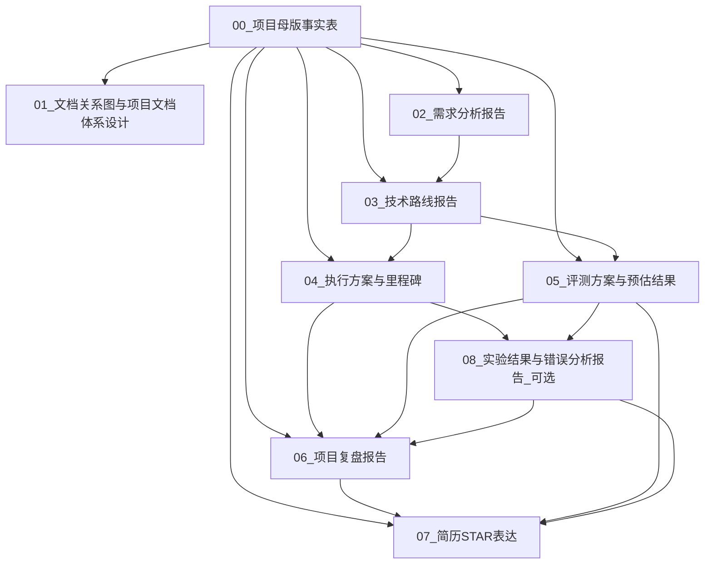

# 00_文档关系图与项目文档体系设计

## 1. 文档体系目标

本项目需要整理成一组相互关联但低耦合的项目文档，用于支撑三个目标：

1. 指导后续项目开发；
2. 沉淀完整项目复盘材料；
3. 最终转化为简历 STAR 表达和面试话术。

当前项目定位为：

**基于 Harness Engineering 的企业 Agentic RAG 知识助手**

或：

**企业 Agentic RAG 知识助手与可控执行 Harness 系统**

当前版本不是复杂 Multi-Agent 系统，而是：

**单 Supervisor Agent + 可插拔 Tool/RAG + Harness Runtime**

因此，所有文档都必须围绕以下主线展开：

```text
企业内部知识管理与业务流程辅助
→ RAG 知识检索
→ Tool Use 工具调用
→ Harness Runtime 执行编排
→ Verifier / Retry 结果校验与失败恢复
→ Trace Logging 轨迹记录
→ Eval 量化评测
→ 简历 STAR 表达
```

---

## 2. 文档体系总览

推荐形成 8 份核心文档：

| 编号 | 文档名称           | 作用                         | 当前状态 |
| -- | -------------- | -------------------------- | ---- |
| 00 | 项目母版事实表        | 固定项目定位、边界、模块和可写亮点          | 已生成  |
| 01 | 文档关系图与项目文档体系设计 | 说明各文档之间的依赖、边界和生成顺序         | 本文档  |
| 02 | 需求分析报告         | 说明项目为什么做、服务什么用户、解决什么场景     | 已生成  |
| 03 | 技术路线报告         | 说明系统技术架构、核心模块和执行流程         | 已生成  |
| 04 | 执行方案与里程碑       | 说明开发计划、阶段产物和验收标准           | 已生成  |
| 05 | 评测方案与预估结果      | 说明评测集、指标、消融实验和预期趋势         | 已生成  |
| 06 | 项目复盘报告         | 汇总项目背景、实现、结果、问题和改进方向       | 后续生成 |
| 07 | 简历 STAR 表达     | 将项目沉淀成简历 bullet、STAR 和面试话术 | 已生成  |

后续如果项目真正实现并跑出实验结果，可以新增：

| 编号 | 文档名称        | 作用                          |
| -- | ----------- | --------------------------- |
| 08 | 实验结果与错误分析报告 | 记录真实指标、失败样例、Trace 分析和消融实验结果 |
| 09 | 面试问题库       | 汇总高频追问、回答边界和项目扩展方向          |

---

## 3. 总体文档关系图



这套关系可以理解为：

```text
项目母版事实表：定边界
需求分析报告：定场景
技术路线报告：定架构
执行方案与里程碑：定开发路径
评测方案与预估结果：定量化标准
项目复盘报告：汇总项目事实与实验结果
简历 STAR 表达：提炼为简历和面试材料
```

---

## 4. 文档层级设计

## 4.1 第一层：事实边界层

### 00_项目母版事实表

作用：

* 固定项目名称；
* 固定项目定位；
* 固定项目和微调项目的区别；
* 固定当前架构边界；
* 明确必须做、简化做、暂不做；
* 防止后续文档过度包装。

该文档是所有后续文档的事实来源。

所有文档都必须遵守以下边界：

```text
当前项目是单 Supervisor Agent + 可插拔 Tool/RAG + Harness Runtime。
当前项目不是复杂 Multi-Agent。
当前项目不做 Agentic RL。
当前项目不做 Skill。
当前项目不做 MCP。
当前项目不接真实企业生产系统。
当前项目使用模拟企业文档和模拟业务数据库。
```

---

## 4.2 第二层：项目定义层

### 01_文档关系图与项目文档体系设计

作用：

* 说明项目文档怎么组织；
* 说明各文档之间的依赖关系；
* 防止不同文档内容重复；
* 明确哪些内容写在哪份文档中；
* 规范后续项目报告和简历表达的生成顺序。

### 02_需求分析报告

作用：

* 回答“为什么做这个项目”；
* 明确目标用户；
* 明确企业知识管理与业务流程辅助场景；
* 明确普通 RAG 的不足；
* 引出 Agentic RAG 和 Harness Runtime 的必要性。

该文档主要回答：

```text
项目解决什么问题？
用户是谁？
需求场景有哪些？
为什么普通 RAG 不够？
为什么需要 Harness Runtime？
```

---

## 4.3 第三层：技术设计层

### 03_技术路线报告

作用：

* 说明系统总体技术路线；
* 说明 RAG、Tool Use、Planner、Context Builder、Permission、Verifier、Trace、Eval 的设计；
* 说明系统从用户请求到最终输出的完整执行流程；
* 说明当前版本的技术选型建议；
* 明确技术难点和不做内容。

该文档主要回答：

```text
系统怎么实现？
每个模块的职责是什么？
数据和执行流程怎么走？
为什么这套架构能解决需求？
```

---

## 4.4 第四层：执行落地层

### 04_执行方案与里程碑

作用：

* 将技术路线拆解为可执行开发任务；
* 定义 4 个里程碑；
* 明确每个阶段的目标、任务、产物和验收标准；
* 控制项目开发范围；
* 避免第一版 demo 做得过重。

推荐里程碑：

```text
M1：数据与 RAG 基础闭环
M2：Tool Contract 与 Agent Runtime
M3：Verifier、Retry、Permission 与 Trace
M4：Eval、Demo 展示与项目总结
```

该文档主要回答：

```text
先做什么？
后做什么？
每周产出什么？
怎么验收？
哪些功能第一版不做？
```

---

## 4.5 第五层：评测验证层

### 05_评测方案与预估结果

作用：

* 定义评测集；
* 定义指标；
* 定义消融实验；
* 说明预估趋势；
* 区分真实结果和预估目标；
* 为后续简历量化表达做准备。

核心评测指标：

```text
RAG Recall@K
Citation Accuracy
Tool Call Accuracy
Tool Success Rate
Task Success Rate
Verifier Pass Rate
Retry Success Rate
Permission Blocking Accuracy
Average Latency
Error Type Distribution
```

推荐消融版本：

```text
V0：Baseline RAG
V1：RAG + Tool Use
V2：RAG + Tool Use + Verifier
V3：Full Harness Runtime
```

该文档主要回答：

```text
怎么证明项目有效？
Harness Engineering 的收益怎么量化？
哪些指标能说明系统更稳定、更可控？
```

---

## 4.6 第六层：复盘沉淀层

### 06_项目复盘报告

作用：

* 汇总前面所有文档；
* 形成完整项目报告；
* 描述项目背景、目标、架构、实现、评测、问题和改进；
* 为简历和面试提供事实依据。

该文档应该在项目完成或至少 demo 跑通后生成。

输入文档：

```text
00_项目母版事实表
02_需求分析报告
03_技术路线报告
04_执行方案与里程碑
05_评测方案与预估结果
真实实验结果或 Trace 分析
```

输出内容：

```text
项目背景
需求场景
系统架构
核心模块
实现细节
评测结果
技术难点
问题与改进
后续扩展
```

注意：

如果还没有真实实验结果，复盘报告只能写“评测方案”和“预期趋势”，不能写已达到具体指标。

---

## 4.7 第七层：简历面试层

### 07_简历 STAR 表达

作用：

* 将项目转成简历 bullet；
* 输出 STAR 结构；
* 输出面试自述；
* 输出高频追问回答；
* 明确不建议夸大的内容。

输入文档：

```text
00_项目母版事实表
03_技术路线报告
05_评测方案与预估结果
06_项目复盘报告
```

输出内容：

```text
项目名称
一句话项目概括
简历 bullet
STAR 表达
60 秒面试自述
2 分钟面试自述
面试追问与回答
不建议夸大的内容
```

该文档主要回答：

```text
项目怎么写进简历？
面试怎么讲？
项目亮点是什么？
边界怎么说清楚？
```

---

## 5. 各文档的输入输出关系

## 5.1 00_项目母版事实表

输入：

* 当前项目设定；
* 当前架构；
* 模块边界；
* Demo 工程结构；
* 暂不做功能。

输出：

* 项目事实基准；
* 项目边界；
* 模块定义；
* 简历可写亮点；
* 待确认问题。

依赖：

* 无。

被依赖：

* 所有文档。

---

## 5.2 01_文档关系图与项目文档体系设计

输入：

* 项目母版事实表；
* 后续文档生成规划。

输出：

* 文档清单；
* 文档依赖关系；
* 文档生成顺序；
* 文档边界；
* 低耦合原则。

依赖：

```text
00_项目母版事实表
```

被依赖：

* 后续所有文档生成流程。

---

## 5.3 02_需求分析报告

输入：

* 项目定位；
* 目标用户；
* 需求场景；
* 普通 RAG 的不足；
* Harness Runtime 的必要性。

输出：

* 项目背景；
* 用户痛点；
* 业务场景；
* 功能性需求；
* 非功能性需求；
* 项目验收标准。

依赖：

```text
00_项目母版事实表
01_文档关系图与项目文档体系设计
```

被依赖：

```text
03_技术路线报告
06_项目复盘报告
07_简历STAR表达
```

---

## 5.4 03_技术路线报告

输入：

* 需求分析报告；
* 项目母版事实表；
* 系统模块设定。

输出：

* 总体架构；
* 系统执行流程；
* RAG 技术路线；
* Tool Use 技术路线；
* Planner / Router 技术路线；
* Context Builder 技术路线；
* Memory、Permission、Verifier、Trace、Eval 技术路线；
* 技术难点；
* 当前不做内容。

依赖：

```text
00_项目母版事实表
02_需求分析报告
```

被依赖：

```text
04_执行方案与里程碑
05_评测方案与预估结果
06_项目复盘报告
07_简历STAR表达
```

---

## 5.5 04_执行方案与里程碑

输入：

* 技术路线报告；
* Demo 工程目录；
* 必须做、简化做、暂不做边界。

输出：

* 开发阶段；
* 每阶段目标；
* 任务拆解；
* 每阶段产物；
* 验收标准；
* 风险与应对；
* 最终交付清单。

依赖：

```text
00_项目母版事实表
03_技术路线报告
```

被依赖：

```text
06_项目复盘报告
08_实验结果与错误分析报告_可选
```

---

## 5.6 05_评测方案与预估结果

输入：

* 技术路线报告；
* 执行方案；
* Trace Logging 设计；
* Eval Set 设计；
* 消融实验设计。

输出：

* 评测对象；
* 测试集设计；
* 指标定义；
* 计算公式；
* 消融版本；
* 预估结果区间；
* 错误类型分析；
* 简历中可写的评测表达。

依赖：

```text
00_项目母版事实表
03_技术路线报告
04_执行方案与里程碑
```

被依赖：

```text
06_项目复盘报告
07_简历STAR表达
08_实验结果与错误分析报告_可选
```

---

## 5.7 06_项目复盘报告

输入：

* 项目事实表；
* 需求分析；
* 技术路线；
* 执行方案；
* 评测方案；
* 实际实现结果；
* 实际评测结果；
* Trace 错误分析。

输出：

* 完整项目总结；
* 技术路线复盘；
* 实验结果分析；
* 难点与解决方案；
* 项目短板；
* 后续扩展；
* 简历素材。

依赖：

```text
00_项目母版事实表
02_需求分析报告
03_技术路线报告
04_执行方案与里程碑
05_评测方案与预估结果
08_实验结果与错误分析报告_可选
```

被依赖：

```text
07_简历STAR表达
```

---

## 5.8 07_简历 STAR 表达

输入：

* 项目母版事实表；
* 技术路线；
* 评测方案；
* 项目复盘；
* 实际指标。

输出：

* 项目名称；
* 项目描述；
* 简历 bullet；
* STAR 表达；
* 面试自述；
* 高频追问；
* 不建议夸大的内容。

依赖：

```text
00_项目母版事实表
03_技术路线报告
05_评测方案与预估结果
06_项目复盘报告
```

被依赖：

* 无。

---

## 6. 内容分布边界

为了避免文档重复，后续文档应按照以下规则分工。

| 内容                      | 主要写在哪份文档    | 其他文档怎么处理   |
| ----------------------- | ----------- | ---------- |
| 项目定位和边界                 | 项目母版事实表     | 只简要引用      |
| 文档依赖关系                  | 文档关系图       | 不在其他文档重复   |
| 用户痛点和需求场景               | 需求分析报告      | 技术文档只引用需求  |
| 系统技术架构                  | 技术路线报告      | 复盘报告总结引用   |
| RAG / Tool / Harness 设计 | 技术路线报告      | 执行文档拆任务    |
| 开发计划和里程碑                | 执行方案与里程碑    | 复盘报告记录完成情况 |
| 评测指标和公式                 | 评测方案与预估结果   | 简历只抽关键指标   |
| 真实实验结果                  | 实验结果与错误分析报告 | 复盘和简历引用    |
| 项目总结                    | 项目复盘报告      | 简历做压缩表达    |
| 简历 bullet 和 STAR        | 简历 STAR 表达  | 不写进技术文档    |

---

## 7. 文档生成顺序

推荐最终生成顺序如下：

```text
第 1 步：00_项目母版事实表
第 2 步：01_文档关系图与项目文档体系设计
第 3 步：02_需求分析报告
第 4 步：03_技术路线报告
第 5 步：04_执行方案与里程碑
第 6 步：05_评测方案与预估结果
第 7 步：07_简历STAR表达
第 8 步：06_项目复盘报告
第 9 步：08_实验结果与错误分析报告
第 10 步：根据真实指标更新 07_简历STAR表达
```

说明：

当前你已经先生成了简历 STAR 表达，这是可以的。
但正式项目完成后，应先补充项目复盘和真实实验结果，再回头更新简历中的量化表达。

---

## 8. 推荐文件命名

### 中文命名

```text
00_项目母版事实表.md
01_文档关系图与项目文档体系设计.md
02_需求分析报告.md
03_技术路线报告.md
04_执行方案与里程碑.md
05_评测方案与预估结果.md
06_项目复盘报告.md
07_简历STAR表达与面试话术.md
08_实验结果与错误分析报告.md
09_面试问题库.md
```

### 英文命名

```text
00_project_master_facts.md
01_document_relationship_map.md
02_requirements_analysis.md
03_technical_roadmap.md
04_execution_plan_and_milestones.md
05_evaluation_plan_and_expected_results.md
06_project_retrospective.md
07_resume_star_and_interview_notes.md
08_experiment_results_and_error_analysis.md
09_interview_qa_bank.md
```

---

## 9. 当前文档体系与项目阶段的对应关系

| 项目阶段 | 对应文档             | 作用         |
| ---- | ---------------- | ---------- |
| 立项阶段 | 项目母版事实表、需求分析报告   | 明确项目边界和需求  |
| 设计阶段 | 技术路线报告、文档关系图     | 明确架构和文档体系  |
| 开发阶段 | 执行方案与里程碑         | 指导模块开发     |
| 测试阶段 | 评测方案与预估结果        | 指导评测集和指标计算 |
| 复盘阶段 | 项目复盘报告、实验结果与错误分析 | 沉淀真实项目经验   |
| 求职阶段 | 简历 STAR 表达、面试问题库 | 形成简历和面试话术  |

---

## 10. 文档低耦合原则

### 10.1 每份文档只解决一个核心问题

| 文档         | 只回答的问题      |
| ---------- | ----------- |
| 项目母版事实表    | 项目是什么，边界是什么 |
| 文档关系图      | 文档怎么组织      |
| 需求分析报告     | 为什么要做       |
| 技术路线报告     | 怎么实现        |
| 执行方案与里程碑   | 怎么推进        |
| 评测方案与预估结果  | 怎么验证        |
| 项目复盘报告     | 做得怎么样       |
| 简历 STAR 表达 | 怎么写进简历      |

### 10.2 技术文档不写简历话术

技术文档中可以写：

```text
Tool Contract 统一定义 name、description、input_schema、permission 和 risk_level。
```

但不在技术文档中写成：

```text
该设计显著提升了我的工程能力。
```

这种表达放在简历 STAR 文档中。

### 10.3 简历文档不展开所有实现细节

简历文档只提炼：

```text
做了什么
用了什么技术
解决什么问题
如何评估
有什么结果
```

不重复大段代码结构和接口定义。

### 10.4 评测文档不编造结果

评测方案中可以写：

```text
预估 Full Harness Runtime 的任务完成率高于 Baseline RAG。
```

不能在没有实验时写：

```text
任务完成率提升 20%。
```

### 10.5 项目复盘必须基于真实实现

项目复盘报告应在代码跑通后更新。

如果某些模块只设计未实现，需要明确标注：

```text
已设计，未实现
```

或：

```text
第一版暂未实现，作为后续扩展
```

---

## 11. 简历表达如何从文档中提取

简历 STAR 表达应从以下文档中提取事实：

| 简历内容    | 来源文档           |
| ------- | -------------- |
| 项目名称    | 项目母版事实表        |
| 项目背景    | 需求分析报告         |
| 技术架构    | 技术路线报告         |
| 主要工作    | 技术路线报告、执行方案    |
| 指标体系    | 评测方案           |
| 实际结果    | 实验结果与错误分析报告    |
| 难点和解决方案 | 项目复盘报告         |
| 后续扩展    | 项目母版事实表、项目复盘报告 |

简历中可以稳定写的内容：

```text
构建企业 Agentic RAG 知识助手
设计单 Supervisor Agent + Harness Runtime 架构
实现 RAG 检索链路
设计 Tool Contract
实现 Tool Use、Verifier、Trace Logging
构建 Eval 评测体系
```

简历中暂时不能写死的内容：

```text
任务完成率提升多少
引用一致率提升多少
工具调用准确率达到多少
已接入真实企业系统
已实现复杂 Multi-Agent
已实现 Agentic RL
已接入 Skill / MCP
```

---

## 12. 后续更新规则

如果后续项目实现发生变化，应按以下顺序更新文档：

### 情况 1：新增功能

例如新增 Rerank、LLM-as-Judge 或 Streamlit 前端。

更新顺序：

```text
00_项目母版事实表
03_技术路线报告
04_执行方案与里程碑
05_评测方案与预估结果
06_项目复盘报告
07_简历STAR表达
```

### 情况 2：跑出了真实指标

例如得到了 Task Success Rate、Tool Call Accuracy、Citation Accuracy。

更新顺序：

```text
05_评测方案与预估结果
08_实验结果与错误分析报告
06_项目复盘报告
07_简历STAR表达
```

### 情况 3：决定加入 Multi-Agent

更新顺序：

```text
00_项目母版事实表
03_技术路线报告
04_执行方案与里程碑
05_评测方案与预估结果
07_简历STAR表达
```

但如果只是后续计划，不要改成“已实现”。

### 情况 4：决定加入 Skill / MCP

当前版本暂不做。
如果后续真的加入，应单独新增文档：

```text
10_Skill与MCP扩展设计.md
```

并更新项目母版事实表。

---

## 13. 当前推荐最终文档包

建议最终整理成以下文档包：

```text
agentic_rag_project_docs/
├── 00_项目母版事实表.md
├── 01_文档关系图与项目文档体系设计.md
├── 02_需求分析报告.md
├── 03_技术路线报告.md
├── 04_执行方案与里程碑.md
├── 05_评测方案与预估结果.md
├── 06_项目复盘报告.md
├── 07_简历STAR表达与面试话术.md
├── 08_实验结果与错误分析报告.md
└── 09_面试问题库.md
```

其中第一版必须完成：

```text
00_项目母版事实表.md
01_文档关系图与项目文档体系设计.md
02_需求分析报告.md
03_技术路线报告.md
04_执行方案与里程碑.md
05_评测方案与预估结果.md
07_简历STAR表达与面试话术.md
```

项目跑通后补：

```text
06_项目复盘报告.md
08_实验结果与错误分析报告.md
09_面试问题库.md
```

---

## 14. 文档关系图总结

这套文档体系的核心逻辑是：

```text
母版事实表负责定边界；
需求分析负责定场景；
技术路线负责定架构；
执行方案负责定开发路径；
评测方案负责定量化标准；
复盘报告负责沉淀真实项目经验；
简历 STAR 负责转化为求职表达。
```

最终所有文档都应服务于同一个项目主线：

```text
这是一个面向企业内部知识管理与业务流程辅助的 Agentic RAG Demo。

系统采用单 Supervisor Agent + 可插拔 Tool/RAG + Harness Runtime 架构，通过 RAG 检索、Tool Use、Planner / Router、Permission、Verifier、Retry 和 Trace Logging，将大模型从单轮问答扩展为可控、可观测、可评估的企业任务执行助手。

项目当前不做 Skill、MCP、复杂 Multi-Agent 或 Agentic RL，但通过 Tool Contract、Trace Logging 和模块化 Runtime 为后续扩展保留工程基础。
```