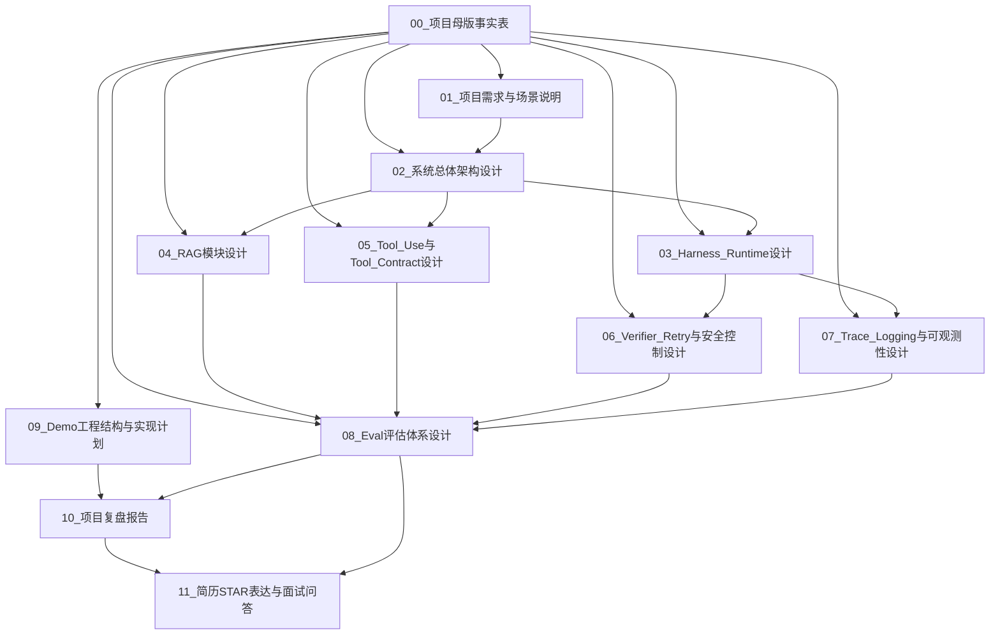

# 文档关系图

## 1. 文档体系总览

本项目文档采用“母版事实表 → 分模块技术文档 → 评估与实验文档 → 简历沉淀文档”的结构。

核心原则：

1. 所有文档都从《项目母版事实表》派生。
2. 各文档之间保持低耦合，避免重复大段内容。
3. 技术文档写实现，评估文档写指标，简历文档写成果表达。
4. 当前项目只写成“单 Supervisor Agent + 可插拔 Tool/RAG + Harness Runtime”，不写成复杂 Multi-Agent 系统。
5. Skill、MCP、Agentic RL、复杂 Multi-Agent 只放在“后续扩展方向”，不进入当前核心文档。

---

## 2. 总体文档关系图



---

## 3. 推荐文档清单

| 编号 | 文档名称                        | 文档作用                      | 是否必须 |
| -- | --------------------------- | ------------------------- | ---- |
| 00 | 项目母版事实表                     | 所有后续文档的事实来源               | 必须   |
| 01 | 项目需求与场景说明                   | 说明项目为什么做、解决什么场景           | 必须   |
| 02 | 系统总体架构设计                    | 说明整体 Agent 架构和数据流         | 必须   |
| 03 | Harness Runtime 设计          | 说明 Agent 运行时如何组织任务、状态和上下文 | 必须   |
| 04 | RAG 模块设计                    | 说明知识库检索链路                 | 必须   |
| 05 | Tool Use 与 Tool Contract 设计 | 说明工具调用体系和统一接口             | 必须   |
| 06 | Verifier / Retry 与安全控制设计    | 说明校验、重试、权限和人工确认           | 建议   |
| 07 | Trace Logging 与可观测性设计       | 说明如何记录执行轨迹                | 必须   |
| 08 | Eval 评估体系设计                 | 说明如何量化项目效果                | 必须   |
| 09 | Demo 工程结构与实现计划              | 说明代码目录、开发顺序、里程碑           | 必须   |
| 10 | 项目复盘报告                      | 汇总项目目标、实现、结果和问题           | 后期生成 |
| 11 | 简历 STAR 表达与面试问答             | 将项目沉淀为简历 bullet 和面试话术     | 最后生成 |

---

## 4. 文档分层关系

### 第一层：事实源

```text
00_项目母版事实表
```

作用：

* 固定项目边界；
* 固定项目名称、定位、模块和不做的内容；
* 防止后续文档写偏；
* 作为所有文档的唯一事实基准。

其他文档不能随意引入母版中没有的核心功能。

---

### 第二层：项目定义文档

```text
01_项目需求与场景说明
02_系统总体架构设计
```

作用：

* 说明项目面向什么用户；
* 解决什么问题；
* 为什么需要 Agentic RAG；
* 为什么需要 Harness Runtime；
* 系统整体如何运行。

这两份文档负责回答：

```text
项目是什么？
为什么要做？
整体架构是什么？
```

---

### 第三层：模块设计文档

```text
03_Harness_Runtime设计
04_RAG模块设计
05_Tool_Use与Tool_Contract设计
06_Verifier_Retry与安全控制设计
07_Trace_Logging与可观测性设计
```

作用：

* 每份文档只解释一个模块；
* 保持低耦合；
* 每个模块说明输入、输出、职责、接口、失败场景和评估方式。

这层文档负责回答：

```text
每个模块怎么做？
输入输出是什么？
和其他模块怎么交互？
```

---

### 第四层：实验与实现文档

```text
08_Eval评估体系设计
09_Demo工程结构与实现计划
```

作用：

* 说明项目如何落地；
* 说明如何评估；
* 说明实验指标和开发顺序；
* 明确哪些指标是计划评估，哪些是实际结果。

这层文档负责回答：

```text
项目如何验证有效？
代码怎么组织？
怎么一步步做出来？
```

---

### 第五层：复盘与简历文档

```text
10_项目复盘报告
11_简历STAR表达与面试问答
```

作用：

* 将前面的技术设计转成项目总结；
* 输出简历 bullet；
* 输出 STAR 表达；
* 输出面试问答。

这层文档负责回答：

```text
项目怎么写进简历？
面试怎么讲？
项目亮点和边界怎么表达？
```

---

## 5. 各文档输入输出关系

### 00_项目母版事实表

输入：

* 当前项目定位；
* 架构设定；
* 模块边界；
* Demo 工程目录；
* 暂不做内容。

输出：

* 项目事实基准；
* 文档写作边界；
* 后续报告共同依据。

依赖：

* 无。

被依赖：

* 所有文档。

---

### 01_项目需求与场景说明

输入：

* 项目母版事实表；
* 需求场景；
* 目标用户；
* 与微调项目的区别。

输出：

* 项目背景；
* 需求场景；
* 用户痛点；
* 为什么需要 Agentic RAG；
* 为什么不写成客服项目。

依赖：

```text
00_项目母版事实表
```

被依赖：

```text
02_系统总体架构设计
10_项目复盘报告
11_简历STAR表达与面试问答
```

---

### 02_系统总体架构设计

输入：

* 项目母版事实表；
* 需求场景说明；
* 当前 Agent 架构。

输出：

* 总体架构图；
* 执行流程图；
* 模块边界；
* 数据流；
* 当前架构与 Multi-Agent 的区别。

依赖：

```text
00_项目母版事实表
01_项目需求与场景说明
```

被依赖：

```text
03_Harness_Runtime设计
04_RAG模块设计
05_Tool_Use与Tool_Contract设计
06_Verifier_Retry与安全控制设计
07_Trace_Logging与可观测性设计
09_Demo工程结构与实现计划
```

---

### 03_Harness_Runtime设计

输入：

* 系统总体架构；
* Planner / Router；
* Context Builder；
* Memory；
* Permission；
* Verifier；
* Trace Logger。

输出：

* Runtime 执行状态定义；
* Agent State 结构；
* Harness 主流程；
* Planner / Router 逻辑；
* Context Builder 设计；
* 与 RAG / Tool / Verifier / Trace 的交互方式。

依赖：

```text
00_项目母版事实表
02_系统总体架构设计
```

被依赖：

```text
06_Verifier_Retry与安全控制设计
07_Trace_Logging与可观测性设计
08_Eval评估体系设计
09_Demo工程结构与实现计划
10_项目复盘报告
```

---

### 04_RAG模块设计

输入：

* 企业知识库场景；
* 文档类型；
* 检索流程；
* 引用溯源要求。

输出：

* 文档解析方案；
* chunk 切分策略；
* embedding 与向量库方案；
* top-k 检索；
* 可选 rerank；
* source / chunk_id / score 返回格式；
* RAG 评估指标。

依赖：

```text
00_项目母版事实表
02_系统总体架构设计
```

被依赖：

```text
03_Harness_Runtime设计
08_Eval评估体系设计
10_项目复盘报告
11_简历STAR表达与面试问答
```

---

### 05_Tool_Use与Tool_Contract设计

输入：

* Tool Use 模块定义；
* search_kb；
* query_sql；
* parse_doc；
* generate_report；
* workflow_check；
* Tool Contract 字段设计。

输出：

* BaseTool 接口；
* 工具注册机制；
* 工具 schema；
* permission / risk_level；
* timeout / retry_policy；
* 工具调用记录格式；
* 工具调用失败处理方式。

依赖：

```text
00_项目母版事实表
02_系统总体架构设计
```

被依赖：

```text
03_Harness_Runtime设计
06_Verifier_Retry与安全控制设计
07_Trace_Logging与可观测性设计
08_Eval评估体系设计
09_Demo工程结构与实现计划
```

---

### 06_Verifier_Retry与安全控制设计

输入：

* Tool Contract；
* Permission / Safety 设计；
* Verifier 检查项；
* Retry / fallback / refusal / HITL 机制。

输出：

* Verifier 规则；
* Retry 策略；
* 高风险操作确认；
* 权限不足处理；
* 输出格式校验；
* 无依据回答拦截；
* 安全失败类型定义。

依赖：

```text
00_项目母版事实表
03_Harness_Runtime设计
05_Tool_Use与Tool_Contract设计
```

被依赖：

```text
07_Trace_Logging与可观测性设计
08_Eval评估体系设计
10_项目复盘报告
11_简历STAR表达与面试问答
```

---

### 07_Trace_Logging与可观测性设计

输入：

* Agent State；
* tool_calls；
* retrieved_docs；
* verifier_result；
* success；
* latency；
* error_type。

输出：

* traces.jsonl 字段定义；
* Trace 数据结构；
* 错误类型分类；
* 轨迹复盘方式；
* 后续评估输入格式；
* 后续 Agentic RL / DPO 扩展基础。

依赖：

```text
00_项目母版事实表
03_Harness_Runtime设计
05_Tool_Use与Tool_Contract设计
06_Verifier_Retry与安全控制设计
```

被依赖：

```text
08_Eval评估体系设计
10_项目复盘报告
11_简历STAR表达与面试问答
```

---

### 08_Eval评估体系设计

输入：

* RAG 输出；
* Tool 调用记录；
* Verifier 结果；
* Trace 日志；
* 测试任务集。

输出：

* Eval Set 设计；
* RAG Recall@K；
* Citation Accuracy；
* Tool Call Accuracy；
* Tool Success Rate；
* Task Success Rate；
* Verifier Pass Rate；
* Average Latency；
* Error Type Distribution；
* 消融实验设计。

依赖：

```text
00_项目母版事实表
04_RAG模块设计
05_Tool_Use与Tool_Contract设计
06_Verifier_Retry与安全控制设计
07_Trace_Logging与可观测性设计
```

被依赖：

```text
10_项目复盘报告
11_简历STAR表达与面试问答
```

---

### 09_Demo工程结构与实现计划

输入：

* Demo 工程目录；
* 系统总体架构；
* 模块设计；
* 必须做 / 简化做 / 暂不做边界。

输出：

* 代码目录说明；
* 开发顺序；
* 里程碑；
* 每个文件的职责；
* 最小可运行闭环；
* 后续扩展点。

依赖：

```text
00_项目母版事实表
02_系统总体架构设计
03_Harness_Runtime设计
04_RAG模块设计
05_Tool_Use与Tool_Contract设计
06_Verifier_Retry与安全控制设计
07_Trace_Logging与可观测性设计
08_Eval评估体系设计
```

被依赖：

```text
10_项目复盘报告
```

---

### 10_项目复盘报告

输入：

* 项目需求；
* 总体架构；
* 各模块设计；
* Demo 实现；
* Eval 结果；
* Trace 分析；
* 项目边界。

输出：

* 项目背景；
* 技术路线；
* 模块实现；
* 实验结果；
* 难点与解决方案；
* 项目短板；
* 后续扩展方向。

依赖：

```text
01_项目需求与场景说明
02_系统总体架构设计
03_Harness_Runtime设计
04_RAG模块设计
05_Tool_Use与Tool_Contract设计
06_Verifier_Retry与安全控制设计
07_Trace_Logging与可观测性设计
08_Eval评估体系设计
09_Demo工程结构与实现计划
```

被依赖：

```text
11_简历STAR表达与面试问答
```

---

### 11_简历STAR表达与面试问答

输入：

* 项目复盘报告；
* Eval 结果；
* 可写亮点；
* 项目边界；
* 面试可能追问。

输出：

* 简历项目名称；
* 简历 bullet；
* STAR 表达；
* 面试自述；
* 面试追问与回答；
* 不建议夸大的内容。

依赖：

```text
10_项目复盘报告
08_Eval评估体系设计
00_项目母版事实表
```

被依赖：

* 无。

---

## 6. 文档生成顺序

推荐生成顺序如下：

```text
第 1 步：00_项目母版事实表
第 2 步：文档关系图
第 3 步：01_项目需求与场景说明
第 4 步：02_系统总体架构设计
第 5 步：03_Harness_Runtime设计
第 6 步：04_RAG模块设计
第 7 步：05_Tool_Use与Tool_Contract设计
第 8 步：06_Verifier_Retry与安全控制设计
第 9 步：07_Trace_Logging与可观测性设计
第 10 步：08_Eval评估体系设计
第 11 步：09_Demo工程结构与实现计划
第 12 步：10_项目复盘报告
第 13 步：11_简历STAR表达与面试问答
```

---

## 7. 高耦合与低耦合边界

### 7.1 高耦合文档

以下文档之间耦合较高，需要保持概念一致：

| 文档 A                | 文档 B                   | 耦合原因             |
| ------------------- | ---------------------- | ---------------- |
| 系统总体架构设计            | Harness Runtime 设计     | Runtime 是总体架构的核心 |
| Harness Runtime 设计  | Tool Contract 设计       | Runtime 需要调用工具   |
| Harness Runtime 设计  | Trace Logging 设计       | Runtime 负责记录执行过程 |
| Tool Contract 设计    | Permission / Safety 设计 | 权限依赖工具元信息        |
| Verifier / Retry 设计 | Eval 评估体系设计            | Verifier 输出会进入评估 |
| Trace Logging 设计    | Eval 评估体系设计            | Eval 依赖 Trace 数据 |

### 7.2 低耦合文档

以下文档应尽量保持低耦合：

| 文档 A       | 文档 B        | 低耦合原则                           |
| ---------- | ----------- | ------------------------------- |
| RAG 模块设计   | SQL 工具设计    | 只通过 Tool Contract 和 Runtime 交互  |
| RAG 模块设计   | Verifier 设计 | RAG 只提供证据，Verifier 只检查证据是否被正确使用 |
| 需求场景说明     | Demo 工程结构   | 需求不直接绑定具体代码实现                   |
| 简历 STAR 表达 | 模块设计文档      | 简历只抽取亮点，不复述所有技术细节               |

---

## 8. 后续文档内容边界

### 8.1 不要重复写的内容

以下内容只在指定文档中详细写，其他文档只引用：

| 内容                       | 主要写在哪个文档                    |
| ------------------------ | --------------------------- |
| 项目定位和边界                  | 00_项目母版事实表                  |
| 用户需求和场景                  | 01_项目需求与场景说明                |
| 总体架构和流程                  | 02_系统总体架构设计                 |
| Agent State 和 Runtime 流程 | 03_Harness_Runtime设计        |
| 文档切分和检索                  | 04_RAG模块设计                  |
| Tool Contract 字段         | 05_Tool_Use与Tool_Contract设计 |
| Retry / HITL / refusal   | 06_Verifier_Retry与安全控制设计    |
| traces.jsonl 字段          | 07_Trace_Logging与可观测性设计     |
| 评估指标公式                   | 08_Eval评估体系设计               |
| 代码目录和开发计划                | 09_Demo工程结构与实现计划            |
| 项目总结                     | 10_项目复盘报告                   |
| 简历 bullet 和 STAR         | 11_简历STAR表达与面试问答            |

---

## 9. 推荐文件命名

```text
00_project_master_facts.md
01_requirements_and_scenarios.md
02_system_architecture.md
03_harness_runtime_design.md
04_rag_module_design.md
05_tool_use_and_contract.md
06_verifier_retry_safety.md
07_trace_logging_observability.md
08_eval_design.md
09_demo_implementation_plan.md
10_project_retrospective_report.md
11_resume_star_and_interview.md
```

中文命名版本：

```text
00_项目母版事实表.md
01_项目需求与场景说明.md
02_系统总体架构设计.md
03_Harness_Runtime设计.md
04_RAG模块设计.md
05_Tool_Use与Tool_Contract设计.md
06_Verifier_Retry与安全控制设计.md
07_Trace_Logging与可观测性设计.md
08_Eval评估体系设计.md
09_Demo工程结构与实现计划.md
10_项目复盘报告.md
11_简历STAR表达与面试问答.md
```

---

## 10. 文档依赖约束

后续生成任何文档时，应遵守以下约束：

1. 所有文档必须基于《项目母版事实表》。
2. 不得把当前项目写成完整 Multi-Agent 系统。
3. 不得写成已实现 Agentic RL。
4. 不得写成已接入 Skill 或 MCP。
5. 不得写成真实企业生产系统。
6. 不得编造评估结果。
7. 如果没有实际数据，只能写“计划评估”“预期目标”“评估脚本设计”。
8. 如果后续实现发生变化，应先更新《项目母版事实表》，再更新相关子文档。
9. 简历文档只能抽取已经在前面文档中出现过的事实。
10. 面试问答必须明确项目边界，避免过度包装。

---

## 11. 当前文档体系的核心主线

最终所有文档要共同服务这条主线：

```text
这是一个面向企业内部知识管理与业务流程辅助的 Agentic RAG Demo。

项目以单 Supervisor Agent 为主控，通过 Harness Runtime 管理任务规划、工具路由、上下文组装、权限校验、结果验证、错误恢复和执行轨迹。

底层通过 RAG 和可插拔业务工具完成知识检索、数据查询、流程判断和报告生成。

项目重点不在于训练模型，而在于构建一个可控、可观测、可评估、可扩展的企业级 Agent 应用架构。
```

---
